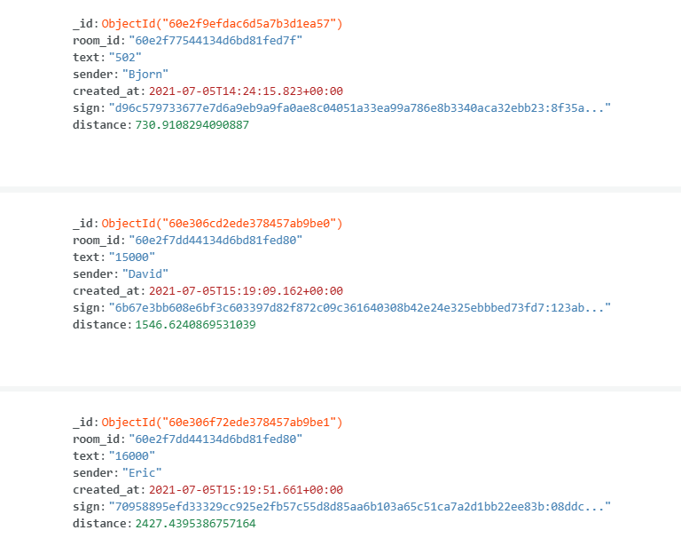
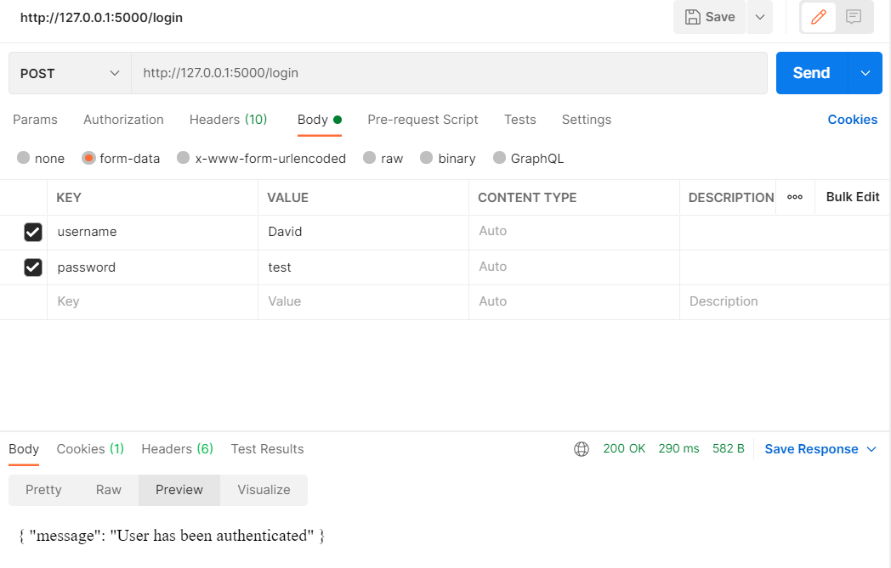

# Negotiation Engine
## First Iteration of REST API for the Negotation Engine for Demand supply matching system
### by Eric Chiquito

This API is written in Python Flask. It is composed by various views and functions which will be explained for use and change in case is needed. All the work presented here is subject to change, either by adding elements or refining the program logic. MongoDB is used in this iteration for the Databases and storage of intermediate bids, the goal for the final product is create a distributed system.

## Installation
1. [**Python FLASK**](https://flask.palletsprojects.com/en/2.0.x/)
2. [**PyMongo**](https://pypi.org/project/pymongo/) 
3. [Werkzeug](https://pypi.org/project/Werkzeug/)
4. [Geopy](https://pypi.org/project/geopy/)

## How to run:

The process to run the current API is very simple, once the above mentioned libraries are installed the only thing missing is run the **app.py** which will start the API in the localhost at port 5000, URL: http://127.0.0.1:5000´.

The API can be tested with [POSTMAN](https://www.postman.com/downloads/) as the examples shown below will illustrate, if you have doubts regarding how data should look, take a look at the following sections.

## Table of contents
* [General Info](#general-info)
* [Data Structure](#data_structure)
  * [Users Database](#users-database)
  * [Template Database](#template-database)
  * [Auction Database](#auction-database)
  * [Auction Details Database](#auction-details-database)
  * [Room Members](#room-members)
  * [Bid Database](#bid-database)
* [Examples of use](#examples-of-use)
  * [User Login](#user-login-POST)
  * [User Logout](#user-logout-GET)
  * [Create Room](#create-room-POST)
  * [Join Auction](#join-auction-GET)
  * [Auction room](#auction-room-GET-POST)
  * [Auction end](#auction-end-GET-POST)
* [Limitations](#limitations)

## General Info:
The purpose of this API is to serve as the negotiation engine for the demand-supply matching of components and materials with an auctioning protocol.
The system shall support the creation, bidding and winner selection for such auctions. In the following sections the data structure for the system along with the fuctionalities description and input requirements are presented.

## Data Structure:
Reiterating what was stated above the data user for this particular iteration of the present implementation is mocked and it does not represent, by any means the final data structure.

### Users Database:

The user database used in this iteration presents the Email, username, password, signature, and location. Password and signature are hashed and location represents latitude and longitude.

### Template Database:

The templates are used for the creation of the Ricardian contract which contains fields to be fields that will be filled once the winner has been selected and the auction is finished.

### Auction Database:

This database contains information regarding the information regarding the creation of the auction and the information of both the auctioneer and the winner. This database feeds the template fields.

### Auction Details Database:

This database is used to query the auctions, contains information about the details and are mostly inputed by the user. These does not feed the template.

### Room Members:

The information of the members of each auction is contained within this database, it states wether the user is admin of such room or not.

### Bid Database:

This database contains information of each bid on every room, contains information of the room, the user, the distance between the auction owner and the bidder.

## Examples of use:
### User Login: POST
Receives:
* Username (String)
* Password (String)

As seen in the above image the login process is fairly straightforward the user inputs the credentials from a existing database and logs in (for this case the password for all users is test)
### User Logout: GET
This route does not receives parameter, accesing this route automatically disconnects the user as follows.

### Create room: POST
Receives:
* Room name (String)
* Starting bid (int)
* Auction type (String)
* Closing time (Datetime) in the following format YYYY-MM-DDTHH:MM:SS
* Reference sector (String)
* Reference type (String)
* Quantity (int)
* Article number (String)
* Members (String)
* Template type (String)

With this request a new auction is created the specified data is used to fill the information that is going to be used to query the auctions as we will see in another section and carries the winner information as well.

### Join auction: GET

This request does not receive parameters but as seen above, the url contains the information of the auction room you want to join into.
In case the user is already in the room the following message will be displayed.

### Auction room: GET, POST
 
GET: 

When issuing a GET request all the bids in that auction will be displayed, only if the user is already a member of the auction.

POST: 
Receives: 
* Bid (int)

The request parameter issues a bid to the database than can be found later by the users.

### Auction end: GET, POST

POST: 
Receives: 
* Winner (String)
In the present auction system the winner is not decided by an algorith, is up to the auctionner to decide who is the winner based on different parameters,
The POST request parameters contain the winner username which will update the database and will fill the contract.
If no winner has been selected the following message will be displayed.

In case a winner has already been selected then the following message is shown.

GET: 
When accessing this view multiple things will happen, if the auction hasn't ended and/or the user is not the winner or the owner, the best bid for each user according to price will be shown.

In the case the user is the owner of the auction or the winner then the ricardian contract with the winner and seller information will be shown as follows.

If no winner has been selected by the time the GET request is processed an error message is displayed.

## Limitations:

The system is very sensitive regarding the data inputs and outputs specifically in dates and location.

Location is a tuple that consist in both longitude and latitude, if the user is created by any other means that by hand the location data can lead to distance computing errors

Dates shall be inputed in the specified format, the format used is the HTML datetime format which may be similar to the frontend to this project you may desire to use, bear that in mind.
